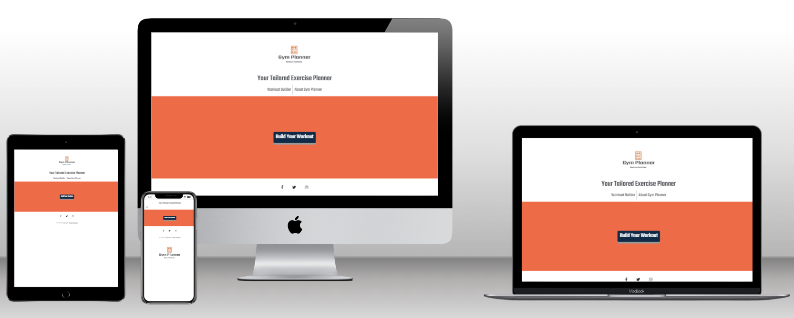
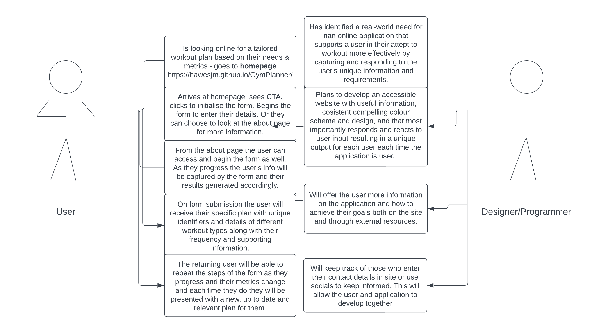

# Gym Planner

## Table of Contents

1. **Introduction**
2. **Structure**
3. **Design**
4. **Limitations**
5. **Features**
6. **Technologies**
7. **Development Lifecycle**
8. **Testing**
9. **Deployment**
10. **Usage**
11. **Collaboration**
12. **Acknowledgments**
13. **Further Development**
14. **Final Notes**

### Introduction

Gym Planner is a web application designed to aid the individual user in developing a specific exercise routine for them personally; based on variables such as their preferred workout type, their goals, along with their age, physique and BMI. The initial goal is for users of all levels of fitness and workout experience to be able to quickly and intuitively set up a basic workout plan to suit their needs. Gym Planner will be responsive for frequent and returning users because as the user continues to exercise and input their new figures (for BMI for example) their tailored workout plan will take these into account and continue to develop the most suitable workout plan for the new given metrics.

The concept was developed for the purpose of completing the second Milestone Project for the Code Institute's Full Stack Developer course. It was built to express the knowledge and skills gained from the HTML, CSS, User Centric Design and Interactive Front End Development modules.

The live website can be found here https://hawesjm.github.io/GymPlanner/

### Structure

##### Architecture

Gym Planner is built using HTML5, CSS and JavaScript according to the principles of creating a responsive and interactive front-end user-centric website. Bootstrap and media queries were also used to ensure responsive design, and occasionally the jQuery library is used. 

##### User Experience Design

For fist time visitors I imagined the user wanting to quickly and easily develop and retrieve a personalised workout plan tailored to them and their needs, without overwhelming information or overly complex data input. For frequent and returning users I wanted offer to a basic framework with which they can set and improve on their own exercise goals, and monitor their personal performance against certain external standards that regular gym goers would be already aware of. In both cases I wanted clear and easily navigable content on desktop, tablet and also mobile device so users can effectively set their goals and monitor their progress while working out or while taking some rest in their downtime. Each page of the website and each step of the form including results page will have a coherent, consistent style.

##### User Stories

##### Navigation

There will be one main page with a header including logo, title and navigation links, as well as a footer containing copyright information and social media links for further engagement. The main page and landing page will be a multi-stage form quiz taking the user's basic information and using it do create and display a specific workout plan tailored to the individual user and their data submitted during the session. The navigation links will provide some introduction and further useful information in the form of external resources and FAQs to aid the user in achieving their goals. The navigation menu will be collapsible on mobile devices to make best use of the available space. Across all devices and screen sizes the layout will remain clean and the order of the main form will progress logically, interactively and intuitively through well signposted submission fields and submission buttons.

### Design

##### Colour Scheme

Over a paper white background the homepage will show a main section and form container using Orange #ED6B47 .  This will contain the main CTA button using Navy Blue #112A46 with a Grey #999 box shadow for contrast. Turquoise #7df9ffb3 and Orange #ED6B47 are used as accent colours for buttons/progress bars and in hover instances to give feedback to the user. White #fafafa is used for text over buttons and form progress steps for clarity and contrast.

##### Typography

The main font used is Teko to enhance the modern industrial feel of the website with provision for using Roboto when this is necessary for further clarity.

##### Imagery

The Gym Planner logo is displayed in the header or footer of all pages, and on all devices and screensizes. The exact placement, positioning and sizing of the logo will change depending on the screen size. The website also displays images for general motivation or to help clarify specific sections of information. Identifying images relevant to the user's results will be shown to add a sense of unique identity to the plans. These will be in keeping with the overall look and feel of the site and branding.

##### Wireframes

###### Homepage

###### Form Page Progress

###### About Page

###### Differences

Form progress bar was made using dots instead of a sliding bar on all devices. 
The logo was moved to the bottom of the form homepage to maximise focus on the main area for mobile devices.
The logo was made smaller for certain screen sizes.
The results table was put inside a flip-card function not detailed in the original plan.

### Limitations

No back end functionality to capture user information for future use.
No APIs for extra external linkage or further functionality at this stage.
Plan titles and animal emblems are generated randomly at this stage and not tied to user input.
Functionality to include and account for user age has yet to be implemented.

### Features

- Responsive and interactive main navigation bar.
- Call to action (CTA) button on homepage to initialise.
- Multi step responsive form for input of user information.
- Form progress bar
- Responsive footer
- Detailed reactive and interactive results page
- Social links
- Further details page

### Technologies

- **HTML**
This project uses HTML as the main language used to complete the structure of the website.
- **CSS**
This project uses custom written CSS to style the Website.
- **JavaScript/JQuery**
This project uses custom written JavaScript to add interactive elements to the website and allow the user to achieve their goals.
- **Bootstrap**
The Bootstrap framework is used throughout this website for layouts and styling.
This has also been used to import JavaScript/JQuery where necessary
- **Font Awesome**
Font awesome Icons are used in the Body of the site and for the Social media links contained in the Footer section of the website.
- **Google Fonts**
Google fonts are used throughout the project to import the Teko and Roboto fonts
- **Code Anywhere**
The IDE for writing the code, using CI approved template
- **GitHub**
GithHub is the hosting site used to store the source code for the Website and Git Pages is used for the deployment of the live site.
- **Google Chrome Developer Tools**
Google Chrome's built in developer tools are used to inspect page elements and help debug issues with the site layout and test different CSS styles.
- **Balsamiq Wireframes**
This was used to create wireframes for 'The Skeleton Plane' stage of UX design.
- **place-hold.it**
Place-hold.it was used to display the colours shown in the Color Scheme section.
-**Lucid**
Lucid Chart was used to create the diagrams for Use Case scenarios, UX Design Principles, and Project Lifecycle planning.

### Development Lifecycle

**Iteration 1**

- Inception: the user is looking for an application to plan their workouts.
- Task: to meet this need the developer/programmer creates a responsive site that details the application's purpose and can hold the input form for user information.
- Increment: form page and supporting information page are to be confirmed responsive, with clear information flow and functioning internal & external links. Then the initial commit is to be made to GitHub as the basis for future deployment.

**Iteration 2**

- Inception: the user wants to enter their information into the application to receive an individual workout plan tailored to their metrics and needs.
- Task: to meet this need the developer/programmer creates a responsive multi-stage form with relevant input fields to contain this information.
- Increment: once the form container has been created, has been tested for responsiveness and for input field validation, the form structure is to be committed to GitHub as the basis for future deployment.

**Iteration 3**

- Inception: the user wants to receive, view and record the individual workout plan the application produces for them following the correct submission of their required information.
- Task: to meet this need the developer/programmer creates a series of functions within their script to act upon and convert the user submitted data into an informative, compelling and useful end product for each individual user and for each separate session on the application.
- Increment: once sufficient functionality has been included in the script to manage individual user data and provide unique identifiers for each plan, the code will be tested and if without errors will be committed to GitHub as the basis for future deployment.
  
**Iteration 4**

- Inception: having fulfilled their need through the application's functionality, the user may wish to return to the application at a later date to enter new information or look for more information and related resources.
- Task: as well as creating a responsive form with relevant scripts to handle new data inputs the developer/programmer will include supporting information and external resources both in the plan itself and in a related but separate page on the site.
- Increment: Once this page has been successfully tested for code, responsiveness and accessibility it will be committed to GitHub as the final pre-deployment stage.

### Testing

##### Strategy

This project depends upon interactivity and reactivity to user input and actions, so the majority of testing is designed to ensure interactive elements function correctly. However this functionality needs to be contained in a site that meets responsivity and accessibility guidelines so procedures to test and ensure this will also be implemented.

All elements should remain on the screen at sizes above 300px.
All internal nav links should direct to the correct pages.
All external links should open in a new window.
All form inputs should be validated on submission.
Form results should vary depending on user submitted information.

##### Initial Bugs (pre-deployment)

CTA button positioning on mobile - solved with media query
Collapsible nav bar not responding on mobile - solved with Bootstrap
Radio buttons could be clicked simply by clicking near them, progressing the form without correct input - solved by using event listener for "change" instead of "click".
About page example variable printed with commas, solved with for loop and "join" method.
White space below footer, solved with position relative in CSS
Form submission using enter button, solved by using a function to cancel enter keypress
Main script throwing errors on about page since it depended on elements present only in Homepage/Form Page (index.html), solved by creating a secondary script and linking tht to about.html instead

##### Testing Methodology

For First Time Users I want to test to ensure the responsiveness of the application on multiple screensizes. This to ensure that whatever device they use they can quickly and conveniently access the application's information and functionality to achieve their goals.
For Returning Users responsivity is key to ensure the user can create new plans as they progress and their information changes, on any device and from any location, even while working out.

For First Time and Returning Users I want to test to ensure that all functionality is easily navigable and accessible, testing on all internal links is therefore necessary.

For First Time and Returning Users I want to test to ensure that all external links function correctly so they can find external resources and keep informed of Gym Planner's updates on social media.

For First Time and Returning Users I want to test to ensure that all inputs are clearly signalled, form steps are easy to follow, and results are reactive to user input and specific to each session on the applcation.

For First Time and Returning Users I want to test to ensure that their particular results are achieved and displayed in an application that combines easy to use intuitive functionllity with compelling and consistent design.

##### Manual Testing Report

- Video 1: testing/gym-planner-responsivity-full-test.mkv
- Video 2: testing/gym-planner-links-test.mkv
- Video 3: testing/gym-planner-form-input-test.mkv
- Video 4: testing/gym-planner-form-validation-test.mkv

### Deployment

No further bugs found between development and deployment as per videos.

Deployed to GitHub pages via "Main" branch using the "pages build and deployment" workflow.

To run locally:
Navigate to the GitHub Repository
Click the Code drop down menu.
Either Download the ZIP file, unpackage locally and open with IDE (This route ends here) OR Copy Git URL from the HTTPS dialogue box.
Open your development editor of choice and open a terminal window in a directory of your choice.
Use the 'git clone' command in terminal followed by the copied git URL.
A clone of the project will be created locally on your machine.

### Usage

The page is publicly available at <https://hawesjm.github.io/GymPlanner/> for users to access freely and navigate accordingly. No login details necessary to fully navigate the site and browse the information contained therein.

### Collaboration

All collaboration welcome to enhance the UX of the site through the development of back end support that tracks and logs the information of people filling in the contact form section of the site.

### Acknowledgments

I'd like to thank my Code Institute assigned mentor Daisy McGirr for her support and input, as well as Matt Bodden for his initial thoughts at the beginning of the project.

### Further Development

It is my intention that GymPlanner becomes the initial part of a larger series of related projects to create an interactive fitness community. As such no code is to be copied or shared externally without express permission.

Age based functionality.
Relevant API linkage.
The ability to share and print plans.
Backend functionality to record user workout progress.

#### Final Notes
